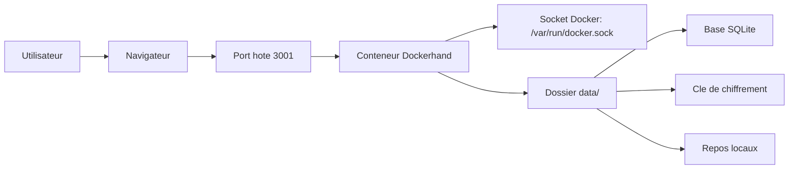

<h1 align="center">Dockerhand</h1>

<p align="center">
  Stack Docker Compose propre et legere pour deployer Dockerhand avec une base d'exploitation claire.
</p>

<p align="center">
  
  
  
  
  
</p>

---

## Vue d'ensemble

Dockerhand est ici presente comme un depot d'infrastructure simple, maintenable et agreable a exploiter:

- configuration externalisee via `.env`
- mise a jour d'image simplifiee avec `make update`
- validation rapide de la stack avec `make validate`
- exposition reseau configurable via `DOCKHAND_BIND_IP`
- documentation d'exploitation et schema d'architecture inclus

## Demarrage rapide

```bash
cp .env.example .env
mkdir -p data/db data/git-repos
docker compose up -d
```

Application disponible par defaut sur `http://localhost:3001`.

Si tu veux limiter l'exposition a la machine locale uniquement:

```bash
DOCKHAND_BIND_IP=127.0.0.1
```

## Commandes utiles

```bash
make up
make down
make restart
make logs
make ps
make validate
make update
```

## Ce Que Le Depot Contient

| Fichier | Role |
| --- | --- |
| [`docker-compose.yaml`](./docker-compose.yaml) | Service Dockerhand et persistance locale |
| [`.env.example`](./.env.example) | Variables d'environnement de base |
| [`Makefile`](./Makefile) | Commandes d'exploitation courantes |
| [`scripts/update.sh`](./scripts/update.sh) | Pull de l'image puis recreation du service |
| [`docs/operations.md`](./docs/operations.md) | Guide d'exploitation |
| [`docs/architecture.md`](./docs/architecture.md) | Schema et vue technique |

## Architecture



## Exploitation

### Validation

```bash
make validate
```

### Mise a jour

```bash
make update
```

### Logs

```bash
make logs
```

## Points de vigilance

- ne jamais committer `data/` ni `.env`
- conserver `data/.encryption_key` avec les donnees existantes
- limiter l'acces au socket Docker a des utilisateurs de confiance

## Documentation

- [Guide d'exploitation](./docs/operations.md)
- [Architecture](./docs/architecture.md)
