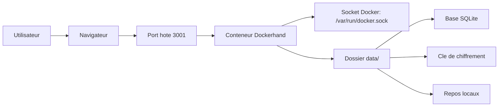

# Architecture

## Vue d'ensemble

## Composants

- `docker-compose.yaml`: declare le service Dockerhand et ses volumes
- `data/`: persistance locale de l'application
- `scripts/update.sh`: recupere la derniere image configuree puis relance le service
- `Makefile`: simplifie les operations frequentes

## Flux techniques

1. l'utilisateur accede a Dockerhand via le port publie sur l'hote
2. Dockerhand pilote l'environnement local via le socket Docker monte
3. les donnees applicatives restent persistantes dans `./data`
4. l'exposition reseau peut etre limitee a `127.0.0.1` via `DOCKHAND_BIND_IP`
